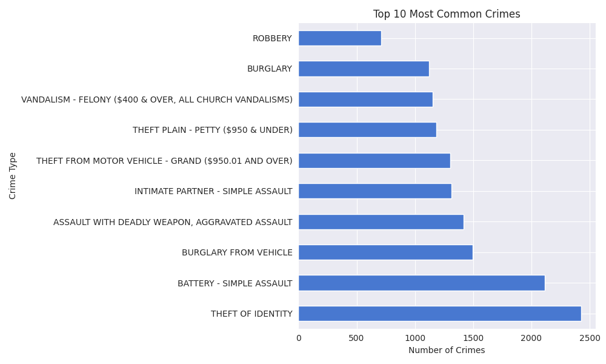
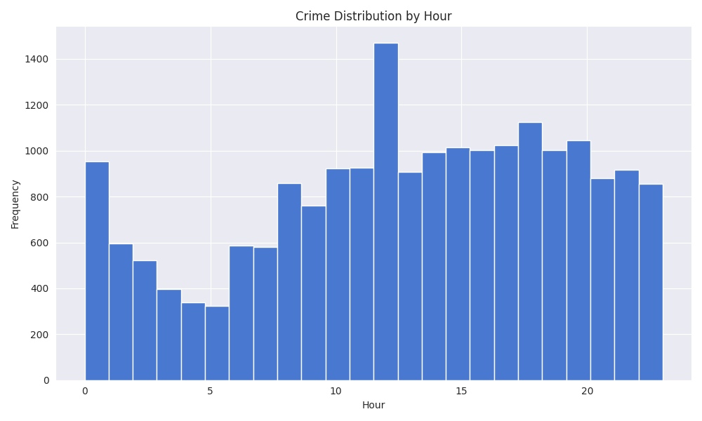
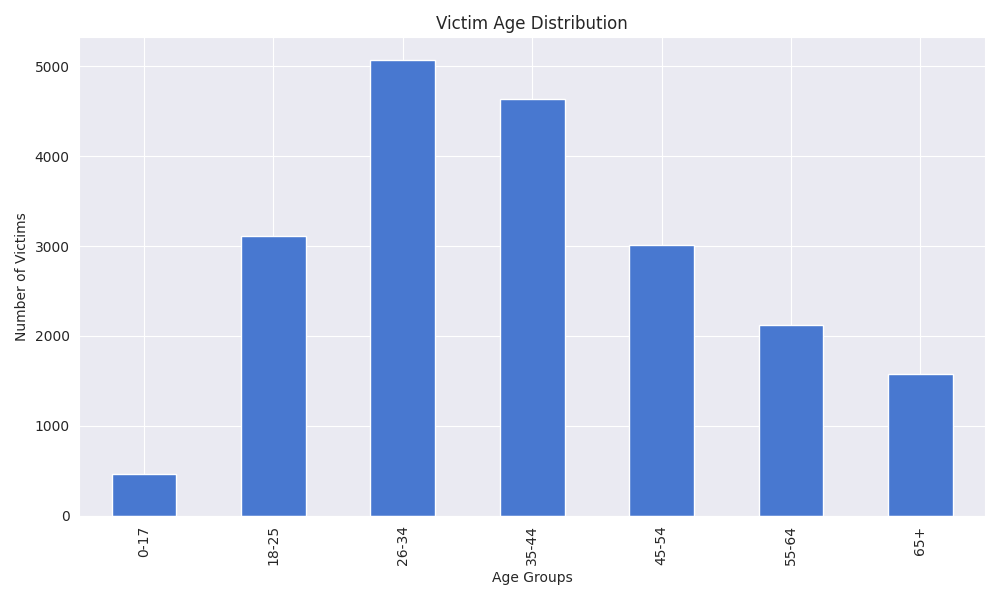

# 🚔 Crime Data Analysis Project

## 📌 Objective
Analyze crime data to uncover patterns in crime timing, location, and victim demographics.

---

## 📊 Key Insights

- 🕛 Peak crime hour: **12 PM**
- 🌙 Most dangerous area at night: **Central**
- 👥 Most affected age group: **26–34**
- 🧾 Most common crime: **Theft of Identity**

---

## 📈 Visualizations

### Top Crimes

### Crime by Hour

### Victim Age Distribution

---

## 🛠️ Tools Used
- Python
- Pandas
- Matplotlib

---

## 📂 Dataset
A sample dataset is included. Full dataset available upon request.
- Download from here:
- https://drive.google.com/file/d/1ibcKZH_B4rTQDjXjhz3aunNu3T6K-bfW/view?usp=drive_link
---

## 🎯 Conclusion
This analysis highlights key crime patterns that can support decision-making and resource allocation.
